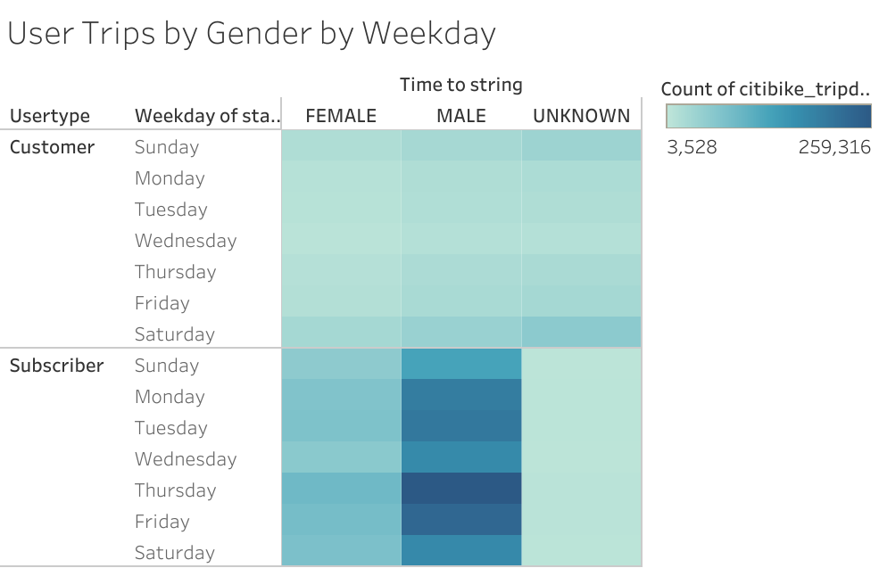

# Bikesharing
Tableau 
# Overview Of Project

  **In this challenge in the first deliverable we use Pandas for creating a DataFrame from .csv file and then we converted the "tripduration" column's datatype from "Int64" to "datetime" as well as create new column name "tripduration_original" in this column we store the original tripduration column data and in the "tripduration" column we stored the new changed datatype data.
  After changing the datatype we converted DataFrame in to the csv file called "citibike_tripdata.csv" and from that csv file we create a set of visualization.**
  
  
  **Show the length of time that bikes are checked out for all riders and genders Show the number of bike trips for all riders and genders for each hour of each day of the week Show the number of bike trips for each type of user and gender for each day of the week. Finally, we’ll add these new visualizations to the two we created in this module for your final presentation and analysis.**
  
* # Deliverable 1: Change Trip Duration to a Datetime Format
  
  
  
  

# Results
* # Deliverable 2: Create Visualizations for the Trip Analysis
### Create the Checkout Times for Users Viz
**In this visualization, you’ll graph the length of time that bikes are checked out for all riders.
Our final results should look similar to the following image:**

### Create the Checkout Times by Gender Viz
**In this visualization, you’ll graph the length of time that bikes are checked out for each gender.
 Our final results should look similar to the following image:**

### Create the Trips by Weekday for Each Hour Viz
**In this visualization, we’ll graph the number of bike trips by weekday for each hour of the day as a heatmap.
Our final results should look similar to the following image:**

### Create the Trips by Gender (Weekday per Hour) Viz
**This visualization, you’ll graph the number of bike trips by gender for each hour of each day of the week as a heatmap.
Result should look like following Image:**

.png)

### Create the User Trips by Gender by Weekday Viz
**In this visualization, you’ll graph the number of bike trips by gender for each hour for each day of the week as a heatmap.
Result should looks like the following Image:**

**Following two are the dashboard link for challenge.**
[Link TO Dashboard1](https://public.tableau.com/views/tripDashboard2/UTBYGenderByWeekdayD?:language=en-US&publish=yes&:display_count=n&:origin=viz_share_link)
[Link TO Dashboard2](https://public.tableau.com/views/tripDashboard1/TripsbyWfEHD?:language=en-US&publish=yes&:display_count=n&:origin=viz_share_link)

 # Deliverable 3: Create a Story and Report for the Final Presentation
 ** 1.There is a line graph displaying the number of bikes checked out by duration for all users, and the graph can be filtered by the hour.
 
   2.There is a line graph displaying the number of bikes that are checked out by duration for each gender by the hour, and the graph can be filtered by the hour and        gender.
   
   3.A heatmap is created showing the number of bike trips for each hour of each day of the week.
   
   4.A heatmap is created showing the number of bike trips by gender for each hour of each day of the week, and the heatmap can be filtered by gender.
   
   5.A heatmap is created showing the number of bike trips for each type of user and gender for each day of the week, and you can only filter by user and gender. **
   
  **HERE WE PRESENT LINK FOR THE STORY OF 5 VISUALIZATION OF DELIVERABLE 2.**
    
 [LINK TO DELIVERABLE2 STORY](https://public.tableau.com/views/Bikesharing_challenge_story/Bikesharing_challenge_story?:language=en-US&:display_count=n&:origin=viz_share_link)

# Summary
    **HERE WE PRESENT THE LINK OF 2 VISUALIZATION FROM MODULE.**
   * [LINK FOR MODULE STORY](https://public.tableau.com/views/NYCStory_16747677190670/NYCStory?:language=en-US&publish=yes&:display_count=n&:origin=viz_share_link)

